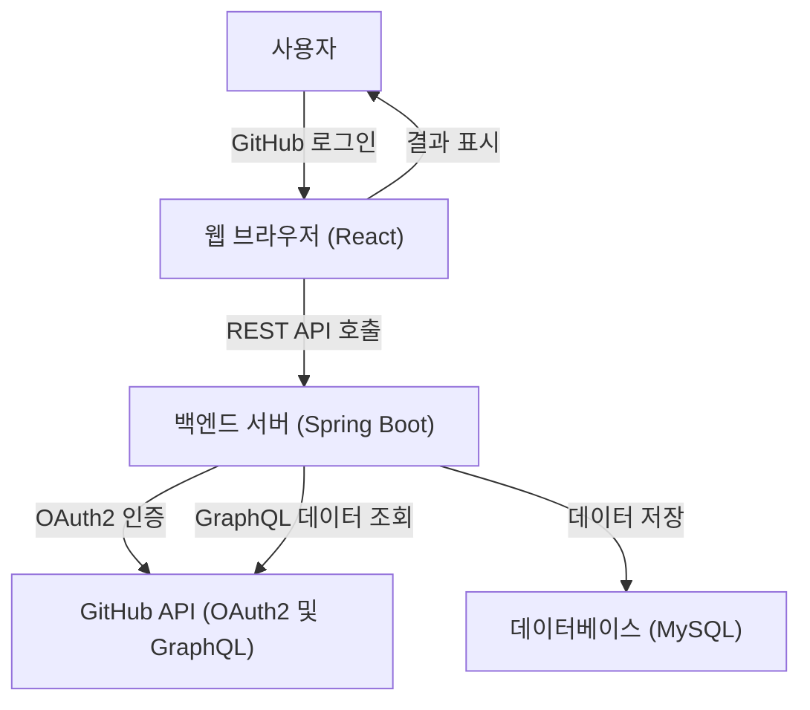
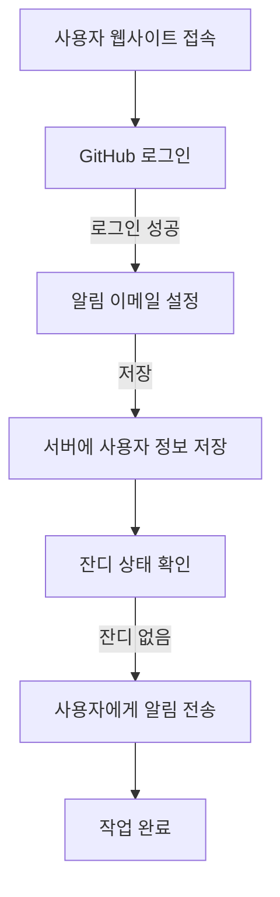
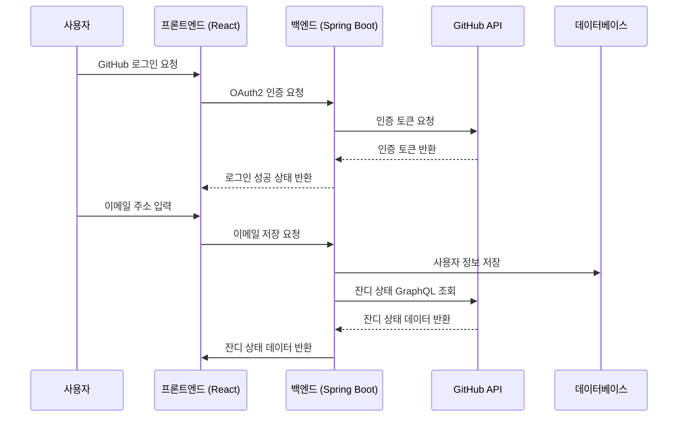

# 🪴 GitGardener - 깃허브 잔디 관리

## 프로젝트 개요
GitGardener는 GitHub 계정을 활용하여 매일 저녁 10시를 기준으로 사용자의 잔디 상태를 관리하고, 알림 이메일을 발송하여 커밋을 유도합니다.

---

## 주요 기능
1. **GitHub 로그인 (OAuth2)**:
   - 사용자는 GitHub 계정을 통해 간단히 로그인할 수 있습니다.
   - OAuth2 인증으로 안전하게 사용자 정보를 관리합니다.
   
2. **이메일 입력 및 알림 설정**:
   - 알림 이메일 주소를 설정하여 커밋 알림을 받을 수 있습니다.
   - 간단한 이메일 입력 폼을 제공하며, 추가 정보 입력은 필요하지 않습니다.

---

## 기술 스택
- **프론트엔드**:
  - React
- **백엔드**:
  - Spring Boot
  - Spring Security OAuth2
- **배포**:
  - 통합 배포
- **API**:
  - GitHub GraphQL API

---

## 시스템 아키텍처

---

## 플로우 차트

---

## 시퀀스 다이어그램

---

## 사용 방법

1. **GitHub 로그인**:
   - 웹사이트에서 "GitHub 계정으로 로그인" 버튼을 클릭합니다.
   - OAuth2 인증을 통해 GitHub 계정을 연결합니다.

2. **알림 이메일 입력**:
   - 알림을 받을 이메일 주소를 입력합니다.

---

## 배포 URL

---

## 문의
- 프로젝트 관련 문의: **star901210@hanmail.net**
- GitHub Repository: [https://github.com/TalkingPotato90/git-gardener](https://github.com/TalkingPotato90/git-gardener)
