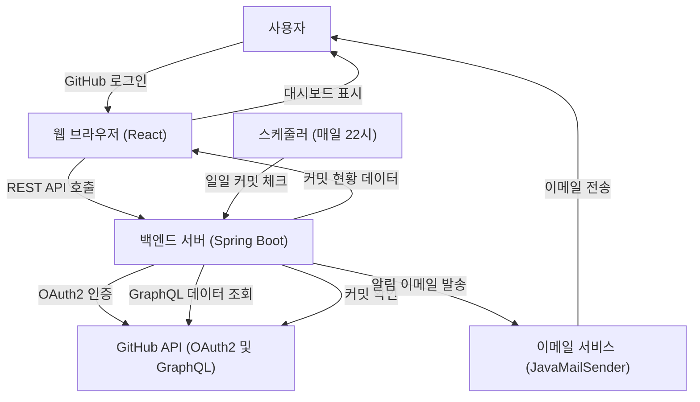
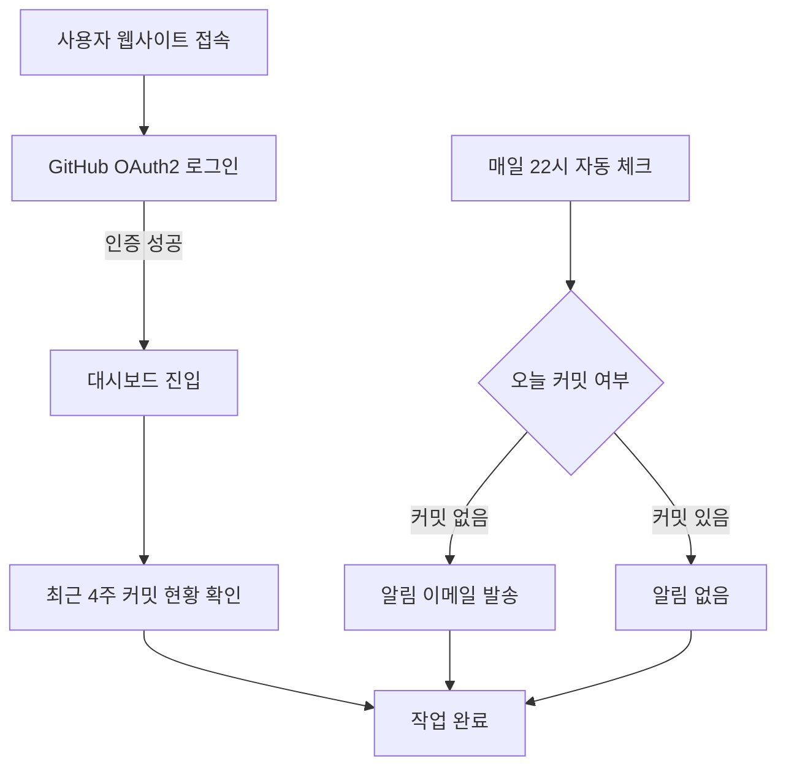
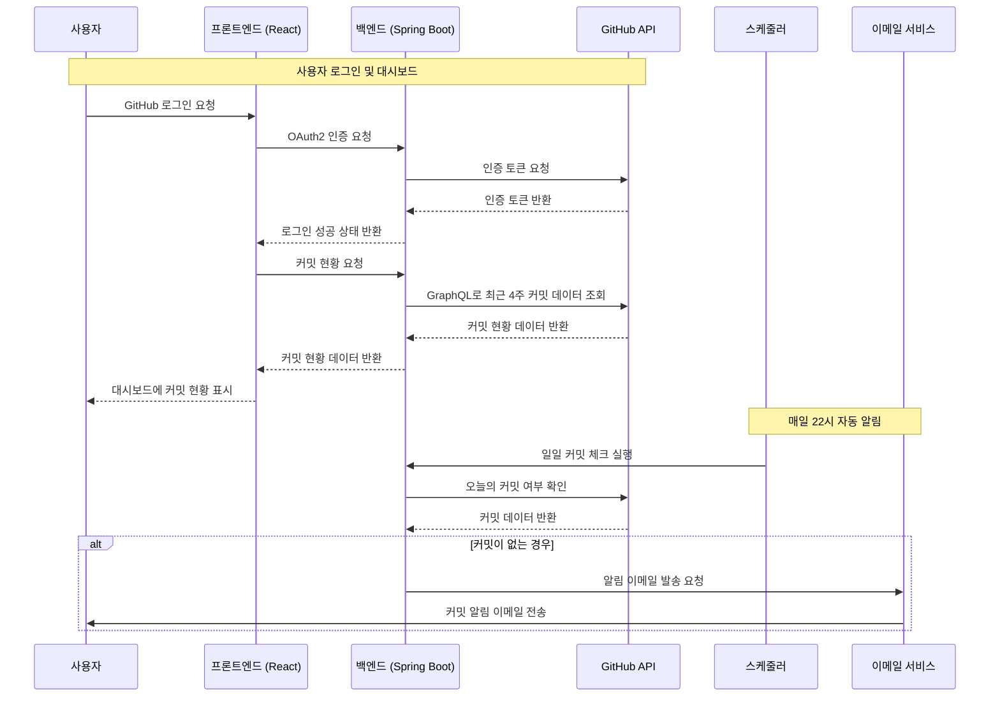

# 🪴 GitGardener - 깃허브 잔디 관리

## 프로젝트 개요
GitGardener는 GitHub 계정을 활용하여 매일 저녁 10시를 기준으로 사용자의 잔디 상태를 관리하고, 커밋을 하지 않은 날에는 알림 이메일을 발송하여 꾸준한 개발 습관을 유도합니다.

---

## 주요 기능
1. **GitHub 로그인 (OAuth2)**:
   - 사용자는 GitHub 계정을 통해 간단히 로그인할 수 있습니다.
   - OAuth2 인증으로 안전하게 사용자 정보를 관리합니다.
   
2. **커밋 현황 대시보드**:
   - 최근 4주간의 커밋 내역을 시각적으로 확인할 수 있습니다.
   - 오늘 날짜는 빨간색으로 강조 표시됩니다.
   - GitHub GraphQL API를 통해 실시간 커밋 데이터를 가져옵니다.

3. **일일 커밋 체크 및 알림**:
   - 매일 저녁 22시(오후 10시)에 자동으로 당일 커밋 여부를 확인합니다.
   - 커밋을 하지 않은 경우 설정된 이메일로 알림을 발송합니다.
   - Spring Boot의 스케줄러를 활용한 자동화된 알림 시스템입니다.

4. **이메일 알림 서비스**:
   - JavaMailSender를 통한 안정적인 이메일 발송 기능을 제공합니다.
   - 커밋 누락 시 개인화된 알림 메시지를 전송합니다.

---

## 기술 스택
- **프론트엔드**:
  - React 18
  - React Context (상태 관리)
  - CSS3 (스타일링)
  
- **백엔드**:
  - Spring Boot 3
  - Spring Security OAuth2
  - Spring Mail (JavaMailSender)
  - Spring Scheduling (@Scheduled)
  - Gradle (빌드 도구)
  
- **외부 API**:
  - GitHub OAuth2 API (인증)
  - GitHub GraphQL API (커밋 데이터 조회)
  
- **개발 도구**:
  - Node.js & npm (프론트엔드 패키지 관리)
  - Gradle (백엔드 의존성 관리)

---

## 시스템 아키텍처


---

## 플로우 차트


---

## 시퀀스 다이어그램


---

## 사용 방법

### 1. GitHub 로그인
웹사이트에 접속하여 "GitHub 계정으로 로그인" 버튼을 클릭합니다.


OAuth2 인증을 통해 GitHub 계정을 안전하게 연결합니다.


### 2. 대시보드 확인
로그인 성공 후 대시보드에서 다음과 같은 정보를 확인할 수 있습니다:

- **최근 4주간의 커밋 내역**: GitHub에서 실시간으로 가져온 커밋 데이터를 시각적으로 표시
- **오늘 날짜 강조**: 현재 날짜는 빨간색으로 표시되어 쉽게 확인 가능
- **로그아웃 옵션**: 
  - "애플리케이션 로그아웃": 앱에서만 로그아웃
  - GitHub 로그아웃 링크: GitHub 계정에서도 완전히 로그아웃


### 3. 자동 알림 시스템
- **매일 22시 자동 체크**: 서버에서 자동으로 당일 커밋 여부를 확인합니다.
- **이메일 알림**: 커밋을 하지 않은 날에는 등록된 이메일로 알림을 발송합니다.
- **개인화된 메시지**: "[GitGardener] 커밋 안했어요." 제목으로 친근한 알림을 받을 수 있습니다.

---

## 실행 방법

### 백엔드 실행
```bash
cd backend
./gradlew bootRun
```

### 프론트엔드 실행
```bash
cd frontend
npm install
npm start
```

---

## 배포 URL

---

## 문의
- 프로젝트 관련 문의: **star901210@hanmail.net**
- GitHub Repository: [https://github.com/CodeOnLeo/git-gardner](https://github.com/CodeOnLeo/git-gardner)